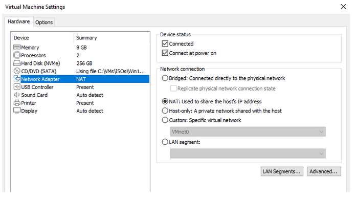
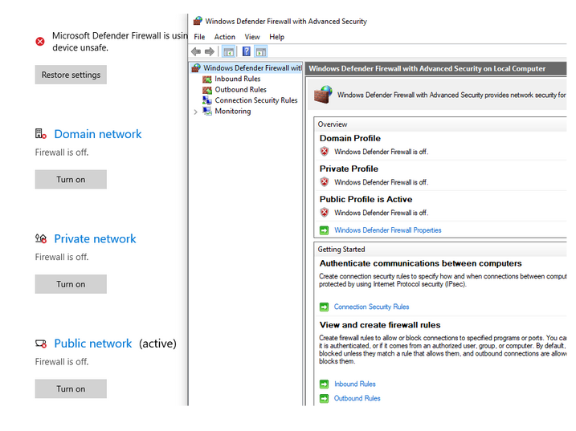
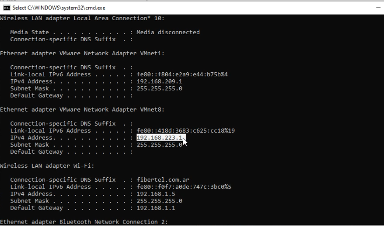
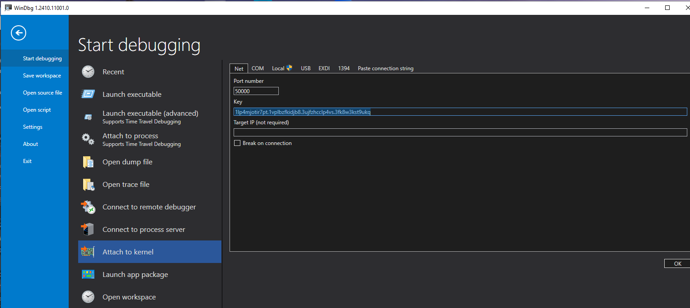
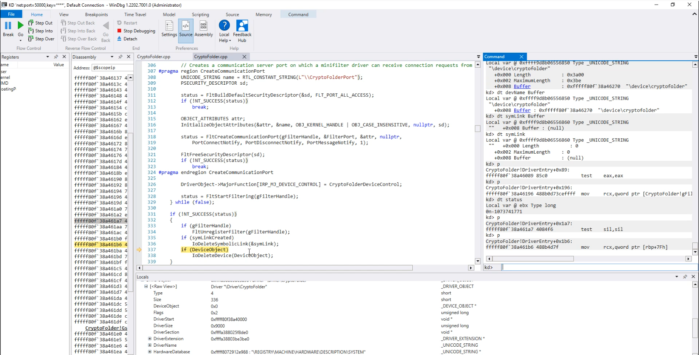

WARNING: This is an unfinished / not fully tested Minifilter driver POC, use on your own risk!

# Install Notes


---
* [How to compile](#how-to-compile)
* [Environment Setup](#environment-setup)
* [Driver Install and Run](#driver-install-and-run)
* [Configure driver](#configure-driver)
* [Monitor driver](#monitor-driver)
* [Remote driver debugging using WinDbg](#remote-driver-debugging-using-winDbg)
---


## How to compile

To compile from source on Windows with Visual Studio open the solution file (.sln), choose the configuration and the platform you want: Release/Debug & Win32/Win64, and then build.


## Environment Setup

The test environment is a host and a target machine Windows 10.
The target machine is a virtualized Windows 10 using VMware.

1- In the target machine the test signing mode has to be enabled, which allows Windows to load unsigned drivers.
To do it, open the command prompt with the administrator privileges and type the following commands:
```
bcdedit /set testsigning on

bcdedit.exe /set nointegritychecks on
```

2- Restart the system to activate the changes.

3- Copy CryptoFolder.sys and CryptoFolder.inf to the target machine.


## Driver Install and Run

1- Open a terminal with administrator privileges.

2- To install the driver, use the 'sc create' command:
```
sc create CryptoFolder type= kernel binPath= <full path to CryptoFolder.sys>
```

3- To start the execution, use the 'sc start' command:
```
sc start CryptoFolder
```

4- To query the driver status, execute the following command:
```
sc query CryptoFolder
```

5- To uninstall the driver, execute the following commands:
```
sc stop CryptoFolder
sc delete CryptoFolder
```


## Configure driver


## Monitor driver


## Remote driver debugging using WinDbg


1- On the host machine build the driver in Debug mode, and copy symbols file CryptoFolder.pdb to your symbols folder.

2- On Windows set the environment variable _NT_SYMBOL_PATH with the following value: SRV*<your_symbol_path>*<msdl_symbols_url>
Example:
```
SRV*c:\symbols*http://msdl.microsoft.com/download/symbols
```

3- On VMware settings set network adapter as NAT:



4- Disable Windows firewall on host and target machine



5- Verify ping between Host and Target machine.

6- Get the host IP addres from the target:



7- Enable kernel debugging on target machine.
   Run the following command in a terminal with administrator privileges:
```
bcdedit /debug on 
```

8- For network debugging, specify host_ip_addres and the port to communicate with on the host debugger. Port should be 49152 or higher.
```
bcdedit /dbgsettings net <host_ip_address>:<port> 
```

9- Copy and save the generated key to your host machine.

10- Restart the system to activate the changes.


11- On Host machine open Windbg, go to Setting, and the Attach to Kernel.
Set the communication port and paste the key you got from dbgsetting on the target machine: 



First of all, enable noisy symbol prompts and reload CryptoFolder.sys

Modify sympath, so it contains a correct path. Assuming CryptoFolder.pdb is located in X:\build\debug\ use the following command:

.sympath+ X:\build\debug\

!sym noisy
.reload /f CryptoFolder.sys





 